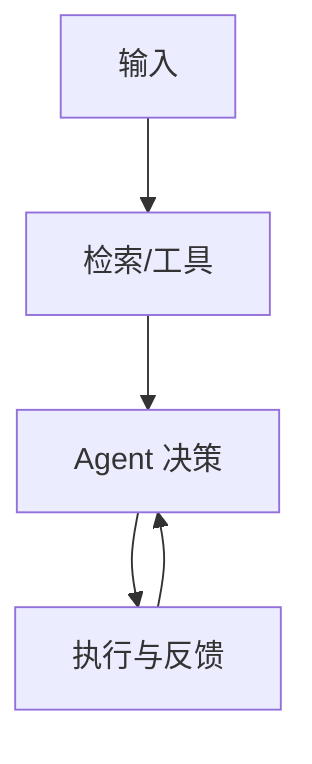

# 比赛：全国腾讯·开悟赛 决赛回顾

本篇记录参赛策略、系统结构与赛后复盘要点。

## 方案概览
- 任务拆分：规划、检索、决策、执行四层
- 模型：大模型 + 轻量规则系统保障稳定性
- 数据：在线检索 + 赛题知识库

## 关键细节
1. 决策树剪枝避免状态爆炸
2. 失败重试与回滚策略
3. 评测指标与日志可溯源

```mermaid
flowchart TD
  A[输入] --> B[检索/工具]
  B --> C[Agent 决策]
  C --> D[执行与反馈]
  D --> C
```

> 最终获得第五名，仍有提升空间：工具调用鲁棒性与延迟优化。

